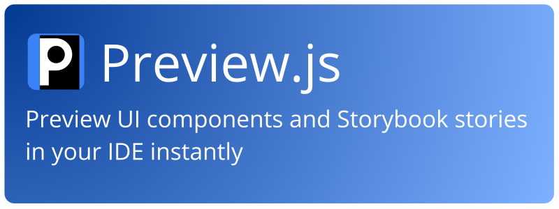

  
   
  
   
  
   
  

 

Preview.js lets you preview React, Preact, Solid, Svelte, Vue components and Storybook stories instantly in your IDE (or in your browser via the CLI).

## Get started

Preview.js is available for:

- [Visual Studio Code](https://marketplace.visualstudio.com/items?itemName=zenclabs.previewjs)
- [IntelliJ / WebStorm](https://plugins.jetbrains.com/plugin/18384-preview-js)
- [CLI](https://previewjs.com/docs/platforms/cli)

## Documentation

[Read the docs to learn more](https://previewjs.com)

## Contributing

Please see the [contributing guide](./CONTRIBUTING.md).

## Sponsors

  

## License

Preview.js is divided into multiple packages, each licensed under either AGPL-3.0 or MIT.

Preview.js Pro is proprietary and not available under an open source license.

Please refer to LICENSE under each directory to find out which license applies.

Copyright (c) 2022-present Zenc Labs Pty Ltd
